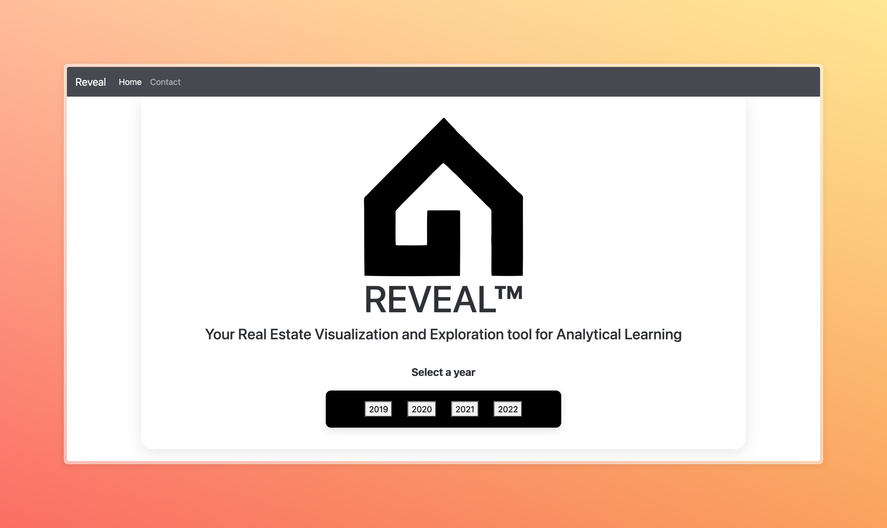
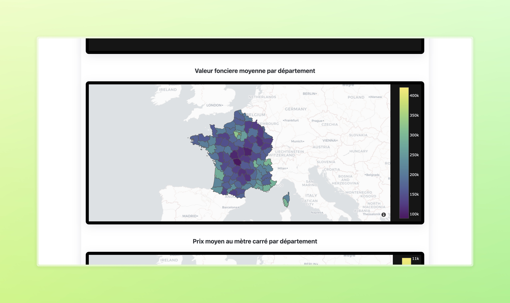

# Reveal

> A simple Django project to explore french Real Estate data.

[](http://reveal.ddns.net)
[]
[](http://reveal.ddns.net)

## Getting Started

### Prerequisites

- Python 3.9
- Pip

### Install

To install the project, start by cloning the repository:

```bash
git clone https://github.com/stantonik/Reveal.git 
```

Then install the dependencies:

```bash
pip install -r requirements.txt
```

That's it! You're ready to go.

### Use

To run the project, just run the following command:

```bash
cd Reveal
python manage.py runserver
```

## Authors

- [**stantonik**](https://github.com/stantonik)
- **Maelys**
- **Olivia**

## License

This project is licensed under the MIT License - see the [LICENSE](LICENSE) file for details.


